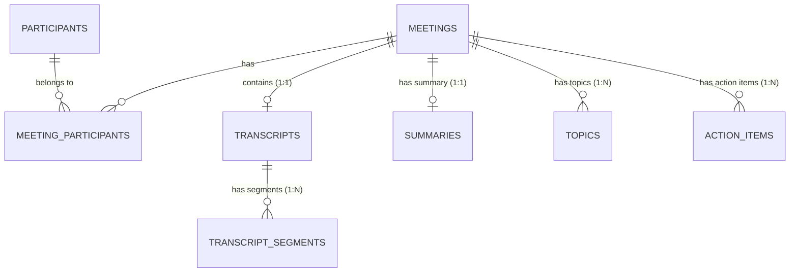

# Velora — Fireflies.ai-Inspired Meeting Intelligence & Transcription Platform

**MeetNote** is a production-quality, full-stack meeting intelligence platform built to capture, transcribe, summarize, and manage meeting notes. Inspired by the product experience and information architecture of Fireflies.ai, MeetNote features real-time audio-transcript synchronization, an interactive two-panel workspace, AI executive summaries, topic chapter markers, trackable action items, and multi-format transcript ingestion (TXT, VTT, JSON).

---

##  Key Features

*  **Meetings Library Dashboard**: Browse, filter (by date, participant), search, and sort past meetings with clean SaaS visual hierarchy.
*  **Real-Time Audio & Transcript Synchronization**: Integrated HTML5 audio player tracking `currentTime`. Active transcript segments highlight automatically and smooth-scroll into view. Clicking any dialogue segment immediately seeks audio playback to its start timestamp.
*  **In-Transcript Keyword Search**: Fast case-insensitive keyword search highlighting matching dialogue lines with match counter and Next/Prev match navigation.
*  **AI Summary & Executive Notes**: High-level meeting overviews, key takeaways, and decisions. Backend service layer is structured with a pluggable interface ready for OpenAI/Anthropic LLM SDK bindings.
*  **Topic Chapters**: Timestamped topic chapter markers allowing instant audio seeking.
*  **Action Items Management**: Full CRUD interface for task items complete with status checkboxes (`pending`, `in_progress`, `completed`), assignees, due dates, optimistic UI updates, and backend database persistence.
*  **Multi-Format Transcript Ingestion**: Paste or upload transcripts in **.txt**, **.vtt** (WebVTT), or **.json** formats, automatically parsed into normalized timestamped database segments.
*  **Global Workspace Search**: Search across meeting titles, participant names, summary overviews, and transcript dialogue lines.
*  **Ask AI (Bonus Feature)**: Interactive chat widget allowing users to ask questions about meeting transcripts.
*  **Automatic Database Seeder**: Pre-populates SQLite with **6 realistic sample meetings** complete with non-lorem-ipsum transcripts, realistic participants, timestamps, summaries, and action items.

---

##  Technology Stack

| Layer | Technology | Rationale |
| :--- | :--- | :--- |
| **Frontend Framework** | Next.js 14+ (App Router) + TypeScript | Modern React framework with strong type safety, App Router directory structure, and clean server/client component isolation. |
| **Styling & Icons** | Tailwind CSS + Lucide React | Utility-first CSS providing modern dark-mode SaaS aesthetics, subtle glassmorphism, responsive grids, and open-source iconography. |
| **Backend Framework** | Python 3.11 + FastAPI | High-performance async REST framework with automatic Pydantic request validation and OpenAPI (Swagger) documentation generation. |
| **Database & ORM** | SQLite + SQLAlchemy 2.0 | Lightweight file-based relational storage with WAL mode enabled. Managed via SQLAlchemy declarative models with cascading deletes and indexed foreign keys. |
| **Testing** | Pytest + FastAPI TestClient | Comprehensive backend test suite covering CRUD APIs, transcript parsing, keyword search, and database operations. |

---

##  Architecture Overview

The system follows a clean 3-tier architecture with explicit separation of concerns:

```
Frontend (Next.js App Router)
   ↓
Centralized API Client (lib/api.ts)
   ↓
FastAPI REST API Gateway (app/api/routes)
   ↓
Service Layer (app/services) — Business Logic & Parsers
   ↓
Repository Layer (app/repositories) — Data Access & Queries
   ↓
SQLAlchemy 2.0 ORM (app/models)
   ↓
SQLite Database (meetnote.db)
```

>  **Design Principle**: FastAPI route handlers contain **zero business logic**. All parsing, search indexing, and summaries are handled within dedicated service classes (`MeetingService`, `TranscriptService`, `SummaryService`, `ActionItemService`, `SearchService`).

For full architecture details, refer to [/docs/architecture.md](file:///d:/Scaler%20assignment/docs/architecture.md).

---

##  Database Schema & Normalization

The database schema is fully normalized to **Third Normal Form (3NF)**:



### Table Summary & Relationships
1. `meetings`: Primary meeting metadata entity (`id`, `title`, `description`, `date`, `duration_seconds`).
2. `participants`: Master table of workspace attendees (`id`, `name`, `email`, `avatar_url`).
3. `meeting_participants`: Junction table representing the **N:M** relationship between meetings and attendees.
4. `transcripts`: Container table (**1:1** with `meetings`) storing raw transcript text.
5. `transcript_segments`: Granular timestamped dialogue chunks (**1:N** with `transcripts` and `meetings`) storing `speaker_name`, `start_time`, `end_time`, `text`, and `sequence`.
6. `summaries`: Executive AI notes (**1:1** with `meetings`) storing overview, key takeaways, and decisions.
7. `topics`: Chapter markers (**1:N** with `meetings`) storing start/end timestamps and topic headers.
8. `action_items`: Trackable tasks (**1:N** with `meetings`) storing title, description, assignee, due date, and status (`pending`, `in_progress`, `completed`).

### Cascading & Indexing Strategy
* **`ON DELETE CASCADE`**: Deleting a meeting automatically cascades to clean up associated transcripts, segments, summaries, topics, action items, and junction records.
* **Indexes**: Composite and single-column indexes on `meetings.date`, `meetings.title`, `transcript_segments.meeting_id`, `transcript_segments.transcript_id`, and `action_items.status` ensure sub-10ms query execution.

For complete database schema explanations, refer to [/docs/database-schema.md](file:///d:/Scaler%20assignment/docs/database-schema.md).

---

##  Getting Started & Setup Guide

### 1. Prerequisites
* Python 3.10+
* Node.js v18+ and npm

### 2. Backend Setup
```bash
# Navigate to backend directory
cd backend

# Create virtual environment
python -m venv .venv

# Activate virtual environment (Windows PowerShell)
.venv\Scripts\Activate.ps1

# Install dependencies
pip install -r requirements.txt

# Create environment configuration
cp .env.example .env

# Initialize and seed database with 6 realistic meetings
python -m app.db.seed

# Start backend server
uvicorn app.main:app --reload --port 8000
```
FastAPI Swagger API Documentation will be available at: `http://localhost:8000/docs`

### 3. Frontend Setup
```bash
# Navigate to frontend directory (in a new terminal)
cd frontend

# Install Node modules
npm install

# Start Next.js development server
npm run dev
```
Open `http://localhost:3000` in your browser.

---

##  Running Tests

### Backend Unit & Integration Tests (Pytest)
```bash
cd backend
.venv\Scripts\pytest
```
*Tests cover Meeting CRUD, Transcript Retrieval, In-Transcript Keyword Search, Parser formats (TXT, VTT, JSON), Action Item Status Toggles, and CASCADE Deletions.*

### Frontend Production Build Verification
```bash
cd frontend
npm run build
```

---

##  API Endpoint Overview

| Method | Endpoint | Description |
| :--- | :--- | :--- |
| `GET` | `/api/meetings` | List all meetings with search, participant filter, and date sorting. |
| `POST` | `/api/meetings` | Create meeting + ingest transcript + auto-generate notes. |
| `GET` | `/api/meetings/{id}` | Get full meeting detail workspace. |
| `PUT` | `/api/meetings/{id}` | Update meeting title, date, or participants. |
| `DELETE` | `/api/meetings/{id}` | Delete meeting and cascade child records. |
| `GET` | `/api/meetings/{id}/transcript` | Get ordered transcript segments. |
| `POST` | `/api/meetings/{id}/transcript/upload` | Upload `.txt`, `.vtt`, or `.json` transcript file. |
| `GET` | `/api/meetings/{id}/transcript/search?q=` | Search keyword within meeting transcript. |
| `GET` | `/api/meetings/{id}/summary` | Get executive summary notes. |
| `POST` | `/api/meetings/{id}/summary/generate` | Re-generate AI summary. |
| `GET` | `/api/meetings/{id}/action-items` | List meeting action items. |
| `POST` | `/api/meetings/{id}/action-items` | Create new action item. |
| `PATCH` | `/api/action-items/{id}/status` | Toggle task status (`pending` -> `completed`). |
| `DELETE` | `/api/action-items/{id}` | Delete action item. |
| `GET` | `/api/search?q=` | Global workspace search across meetings & transcripts. |
| `POST` | `/api/meetings/{id}/ask-ai` | Ask AI question about meeting context. |

For detailed payloads and response envelopes, see [/docs/api.md](file:///d:/Scaler%20assignment/docs/api.md).

---

##  Design Decisions & Interview Preparation

1. **Why Next.js App Router + TypeScript?**
   * Eliminates prop-drilling errors through centralized TypeScript definitions (`types/index.ts`). Page routing (`/meetings`, `/meetings/[id]`, `/tasks`, `/settings`) provides intuitive URL structures matching modern SaaS applications.
2. **How Transcript Synchronization Works**:
   * HTML5 `<audio>` fires `timeupdate` events during playback.
   * `TranscriptPanel` tracks `currentTime` and computes active segment index (`start_time <= currentTime < end_time`).
   * Active segment receives highlighted styling and automatically executes `scrollIntoView({ behavior: 'smooth', block: 'nearest' })`.
   * Clicking any segment sets `audio.currentTime = segment.start_time` and invokes `.play()`.
3. **Why SQLite + SQLAlchemy 2.0?**
   * Zero external daemon configuration required for evaluations, while SQLAlchemy 2.0 ORM enables seamless switching to PostgreSQL for cloud deployment simply by changing `DATABASE_URL`.
4. **LLM Extensibility**:
   * `SummaryService.generate_summary()` isolates summary generation logic. Connecting OpenAI or Anthropic requires updating a single service method without touching API routes or React components.

---

## Deployment

- Frontend: https://velora-frontend-7bng.onrender.com
- Backend API: https://velora-ai-meeting-intelligence.onrender.com
- API Documentation: https://velora-ai-meeting-intelligence.onrender.com/docs

## Final Acceptance Checklist

- [x] **Meetings Library**: Grid display, search input, date sorting, participant filter dropdown, skeleton loading states, empty state CTA.
- [x] **Interactive Transcript**: Speaker labels, timestamps, active segment highlight, auto-scroll, click-to-seek audio playback.
- [x] **In-Transcript Search**: Keyword highlighting, match count display ("Match 1 of 4"), Next/Prev match navigation.
- [x] **Media Player**: HTML5 audio controls, play/pause, seek scrubber, speed selector (0.75x–2.0x), +/- 15s skip buttons.
- [x] **AI Summary**: Executive overview, key takeaways bullet list, decision tag badges.
- [x] **Topic Chapters**: Chapter timeline markers with timestamp audio seek triggers.
- [x] **Action Items**: Full CRUD (create, edit, delete, status toggle checkboxes) with backend database persistence and toast notifications.
- [x] **Meeting CRUD**: Create modal (tabbed TXT/VTT/JSON upload), update metadata modal, delete confirmation modal with cascade warnings.
- [x] **Database Seeding**: Automated `python -m app.db.seed` script populating 6 realistic sample meetings.
- [x] **Backend Quality**: FastAPI routes, Pydantic schemas, SQLAlchemy models, SQLite database, 100% passing pytest suite.
- [x] **Documentation**: Complete `/docs` folder (`architecture.md`, `database-schema.md`, `api.md`, `implementation-plan.md`) and root `README.md`.
