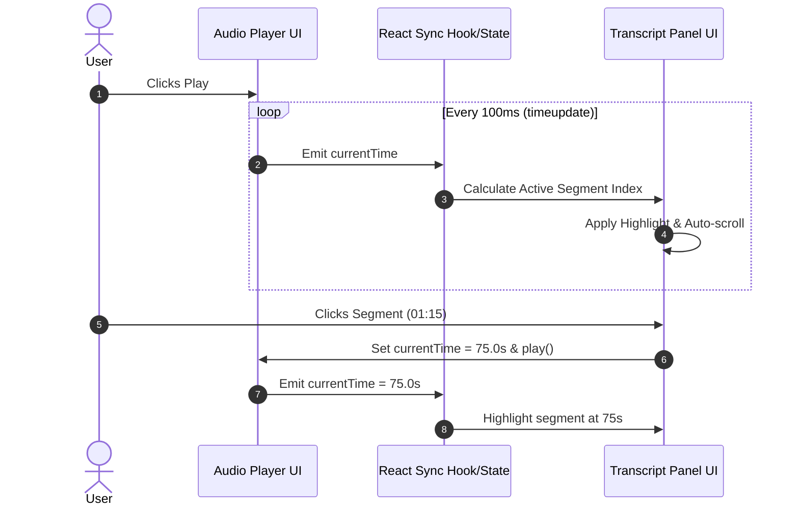

# System Architecture - MeetNote Platform

## Overview
**MeetNote** is a production-grade meeting intelligence and transcription platform inspired by Fireflies.ai. It provides real-time audio-transcript synchronization, AI-generated summary visualization, topic segmentation, action item tracking, meeting CRUD, and multi-format transcript ingestion (TXT, VTT, JSON).

This document outlines the system architecture, component interactions, data flow, and design rationale to prepare for technical evaluations.

---

## 1. High-Level Architecture

The platform follows a classic, decoupled full-stack architecture with clear separation of concerns.

```mermaid
graph TD
    Client["Client (Browser / React UI)"]
    NextServer["Next.js App Router & API Client Layer (lib/api)"]
    FastAPI["FastAPI Gateway (backend/app/api/routes)"]
    ServiceLayer["Service Layer (app/services)"]
    RepoLayer["Repository Layer (app/repositories)"]
    ORM["SQLAlchemy ORM (app/models)"]
    Database[("SQLite Database (app.db)")]

    Client -->|User Interactions / Audio Seeking| NextServer
    NextServer -->|REST API Requests (JSON)| FastAPI
    FastAPI -->|Input Validation (Pydantic)| ServiceLayer
    ServiceLayer -->|Business Logic / Parsing / Aggregations| RepoLayer
    RepoLayer -->|Queries / Mutations| ORM
    ORM -->|SQL Queries| Database
```

---

## 2. Layered Responsibilities

### A. Frontend Layer (Next.js 14+ TypeScript + Tailwind CSS)
* **Framework**: Next.js App Router for page routing (`/meetings`, `/meetings/[id]`, `/settings`).
* **UI Components**: Atomic design pattern dividing UI into `layout`, `meetings`, `meeting`, and `common` UI components.
* **API Client**: Centralized, typed API layer (`lib/api/*.ts`) using native `fetch` with strict error handling, eliminating scattered raw HTTP calls.
* **State Management**: React `useState`, `useContext`, `useRef`, and `useMemo` for interactive player state, search highlights, and real-time audio synchronization.

### B. Backend API Layer (Python 3.10+ & FastAPI)
* **Framework**: FastAPI for async RESTful API routes, request validation, and OpenAPI (Swagger) documentation generation.
* **Router Layer (`app/api/routes`)**: Pure HTTP handlers that handle route registration, path parameters, status codes, and return Pydantic response models. **Zero business logic** resides in routes.
* **Validation Layer (`app/schemas`)**: Pydantic models for strict payload validation, request deserialization, and response serialization.

### C. Service Layer (`app/services`)
* Encapsulates all domain and business logic (e.g., transcript parsing for TXT/VTT/JSON, auto-generating summary mocks, computing audio segment active states, global search indexing).
* Keeps route handlers lean and repository queries modular.
* Pluggable LLM integration interface ready for future OpenAI/Anthropic SDK bindings.

### D. Repository Layer (`app/repositories`)
* Abstracts SQLAlchemy database operations.
* Handles CRUD queries, filters, joins, and cascading deletion routines.

### E. Persistence Layer (SQLite + SQLAlchemy 2.0)
* **ORM**: SQLAlchemy declarative models with explicit foreign keys, indexes, and relationship cascading.
* **Database**: Lightweight, file-based SQLite database with WAL (Write-Ahead Logging) mode enabled for efficient concurrent reads.

---

## 3. Data Flow Architecture

### Workflow 1: Audio & Transcript Synchronization (Real-Time Playback)
1. User loads `/meetings/[id]`. Frontend fetches meeting metadata, transcript segments, summary, and action items concurrently via REST.
2. HTML5 `<audio>` element fires `timeupdate` event during playback (e.g., every ~100-250ms).
3. `AudioPlayer` syncs `currentTime` into state or Context.
4. `TranscriptPanel` evaluates active segment: `start_time <= currentTime < end_time`.
5. Active segment element receives distinct highlight styling and smooth auto-scrolling into view (`scrollIntoView({ behavior: 'smooth', block: 'nearest' })`).
6. Clicking any `TranscriptSegment` sets `audio.currentTime = segment.start_time` and triggers immediate playback.



### Workflow 2: Multi-Format Transcript Ingestion & Meeting Creation
1. User fills out modal form (Title, Date, Participants) and pastes transcript text OR uploads `.txt`, `.vtt`, `.json`.
2. Frontend sends payload via `POST /api/meetings`.
3. `MeetingService` receives raw payload and invokes `TranscriptParser`.
4. Parser normalizes transcript into standard `TranscriptSegment` objects with start time, end time, speaker, and text.
5. `SummaryService` auto-generates structured overview, key takeaways, topics, and initial action items.
6. Data is committed atomically within a single SQLAlchemy transaction.
7. System returns `201 Created` with full meeting object, and frontend redirects to `/meetings/[id]`.

---

## 4. Key Architectural & Design Decisions

| Decision | Rationale | Alternatives Considered |
| :--- | :--- | :--- |
| **Next.js App Router + TypeScript** | Type safety across the application, fast client navigation, server-ready rendering capabilities. | Plain Vite/React (less structured routing), React SPA. |
| **FastAPI Layered Architecture** | Clean separation (Routes -> Services -> Repositories -> Models), automatic OpenAPI generation, fast execution. | Django (overkill for REST API), Flask (lacks native async and schema validation). |
| **SQLAlchemy ORM + SQLite** | Zero-config database storage, atomic ACID compliance, seamless schema mapping, easily portable for evaluations. | PostgreSQL (requires background daemon setup), Raw SQL (error-prone). |
| **Pydantic Schemas** | Guarantees strict input validation and response shaping, avoiding exposure of internal DB fields (e.g. passwords/internal flags). | Manual dict validation (fragile). |
| **Centralized API Client (`lib/api`)** | Single source of truth for base URLs, error handling, headers, and request formatting. | Scattering `fetch()` inside components (hard to maintain). |

---

## 5. Non-Functional Requirements & Readiness

* **Performance**: Audio sync operates without UI stutter by avoiding full re-renders (using isolated active index evaluation).
* **Maintainability**: Modular files under 200-300 lines of code following clear single-responsibility principles.
* **Extensibility**: `SummaryService` and `MeetingQAService` are designed with interface methods so an LLM provider (e.g. OpenAI GPT-4) can be plugged in by updating a single service implementation.
