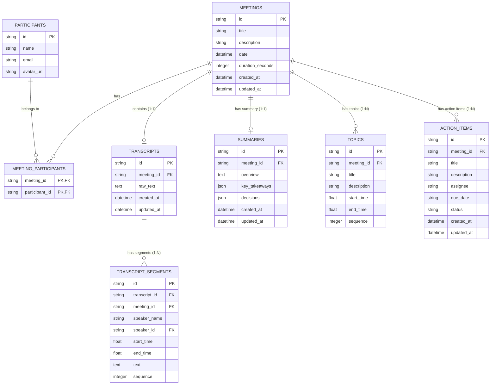

# Database Schema Documentation - MeetNote Platform

## Overview
MeetNote uses **SQLite** managed via **SQLAlchemy ORM (v2.0)**. The schema is normalized (3NF) to ensure data integrity, minimize redundancy, and optimize query performance for meeting libraries, interactive transcripts, AI summaries, key topics, and action items.

---

## 1. Entity-Relationship Diagram (ERD)

---

## 2. Table Specifications & Rationale

### 1. `meetings`
* **Purpose**: Core entity representing a meeting session.
* **Fields**:
  * `id` (VARCHAR(36), PK): UUID primary key.
  * `title` (VARCHAR(255), NOT NULL, Indexed): Meeting title.
  * `description` (TEXT, Nullable): Optional meeting agenda/notes preview.
  * `date` (DATETIME, NOT NULL, Indexed): Date and time meeting took place.
  * `duration_seconds` (INTEGER, Default 0): Total meeting duration in seconds.
  * `created_at` / `updated_at` (DATETIME): Timestamp metadata.
* **Indexes**: `ix_meetings_date`, `ix_meetings_title`.
* **SQLAlchemy Model**: `Meeting`

### 2. `participants`
* **Purpose**: Master table of meeting attendees/speakers across the workspace.
* **Fields**:
  * `id` (VARCHAR(36), PK): UUID.
  * `name` (VARCHAR(100), NOT NULL, Indexed): Full name.
  * `email` (VARCHAR(255), Unique, Indexed): Email address.
  * `avatar_url` (VARCHAR(500), Nullable): Link to profile avatar.
* **Indexes**: `ix_participants_name`, `ix_participants_email`.
* **SQLAlchemy Model**: `Participant`

### 3. `meeting_participants`
* **Purpose**: Junction table implementing the **Many-to-Many (N:M)** relationship between `meetings` and `participants`. (A meeting has multiple participants, and a participant attends multiple meetings).
* **Fields**:
  * `meeting_id` (VARCHAR(36), PK, FK -> `meetings.id` ON DELETE CASCADE)
  * `participant_id` (VARCHAR(36), PK, FK -> `participants.id` ON DELETE CASCADE)
* **SQLAlchemy Model**: `MeetingParticipant`

### 4. `transcripts`
* **Purpose**: Represents the root transcript container for a meeting (**1:1** with `meetings`).
* **Fields**:
  * `id` (VARCHAR(36), PK): UUID.
  * `meeting_id` (VARCHAR(36), FK -> `meetings.id` ON DELETE CASCADE, Unique, Indexed).
  * `raw_text` (TEXT, Nullable): Complete unparsed transcript text.
  * `created_at` / `updated_at` (DATETIME).
* **SQLAlchemy Model**: `Transcript`

### 5. `transcript_segments`
* **Purpose**: Highly granular timestamped dialogue chunks (**1:N** with `transcripts` and `meetings`). Required for real-time audio playback synchronization and targeted text search.
* **Fields**:
  * `id` (VARCHAR(36), PK): UUID.
  * `transcript_id` (VARCHAR(36), FK -> `transcripts.id` ON DELETE CASCADE, Indexed).
  * `meeting_id` (VARCHAR(36), FK -> `meetings.id` ON DELETE CASCADE, Indexed).
  * `speaker_name` (VARCHAR(100), NOT NULL): Name of the speaker for this segment.
  * `speaker_id` (VARCHAR(36), FK -> `participants.id` ON DELETE SET NULL, Nullable).
  * `start_time` (FLOAT, NOT NULL): Segment start time in seconds (e.g., `12.5`).
  * `end_time` (FLOAT, NOT NULL): Segment end time in seconds (e.g., `17.2`).
  * `text` (TEXT, NOT NULL): Spoken content.
  * `sequence` (INTEGER, NOT NULL): Sequential index within the transcript for deterministic order.
* **Indexes**: `ix_transcript_segments_meeting_id`, `ix_transcript_segments_transcript_id`.
* **SQLAlchemy Model**: `TranscriptSegment`

### 6. `summaries`
* **Purpose**: Stores AI-generated executive summaries (**1:1** with `meetings`).
* **Fields**:
  * `id` (VARCHAR(36), PK): UUID.
  * `meeting_id` (VARCHAR(36), FK -> `meetings.id` ON DELETE CASCADE, Unique, Indexed).
  * `overview` (TEXT, NOT NULL): High-level meeting summary paragraph.
  * `key_takeaways` (JSON/TEXT, Default '[]'): List of bullet point strings.
  * `decisions` (JSON/TEXT, Default '[]'): List of decision strings.
  * `created_at` / `updated_at` (DATETIME).
* **SQLAlchemy Model**: `Summary`

### 7. `topics`
* **Purpose**: Chapter markers with start/end timestamps (**1:N** with `meetings`).
* **Fields**:
  * `id` (VARCHAR(36), PK): UUID.
  * `meeting_id` (VARCHAR(36), FK -> `meetings.id` ON DELETE CASCADE, Indexed).
  * `title` (VARCHAR(255), NOT NULL): Topic header.
  * `description` (TEXT, Nullable): Brief summary of topic discussion.
  * `start_time` (FLOAT, NOT NULL): Topic start timestamp.
  * `end_time` (FLOAT, NOT NULL): Topic end timestamp.
  * `sequence` (INTEGER, NOT NULL): Sequence ordering.
* **SQLAlchemy Model**: `Topic`

### 8. `action_items`
* **Purpose**: Trackable task items assigned during the meeting (**1:N** with `meetings`).
* **Fields**:
  * `id` (VARCHAR(36), PK): UUID.
  * `meeting_id` (VARCHAR(36), FK -> `meetings.id` ON DELETE CASCADE, Indexed).
  * `title` (VARCHAR(255), NOT NULL): Action item title.
  * `description` (TEXT, Nullable): Detailed instructions.
  * `assignee` (VARCHAR(100), Nullable): Name or email of assigned team member.
  * `due_date` (VARCHAR(50), Nullable): ISO date string or formatted date.
  * `status` (VARCHAR(20), Default 'pending'): `'pending'`, `'in_progress'`, or `'completed'`.
  * `created_at` / `updated_at` (DATETIME).
* **Indexes**: `ix_action_items_meeting_id`, `ix_action_items_status`.
* **SQLAlchemy Model**: `ActionItem`

---

## 3. Normalization & Design Rationale

1. **Third Normal Form (3NF)**:
   * Attributes in each table depend solely on the primary key (e.g. `ActionItem` contains task state, avoiding clutter in `Meeting`).
   * `TranscriptSegment` isolates timestamped spoken dialogue from high-level `Meeting` metadata.
2. **Cascading Behavior (`ON DELETE CASCADE`)**:
   * Deleting a `Meeting` automatically cascades and deletes associated `Transcript`, `TranscriptSegments`, `Summary`, `Topics`, `ActionItems`, and `MeetingParticipants`. This maintains database hygiene and prevents orphaned records.
3. **Indexing Strategy**:
   * Foreign keys (`meeting_id`, `transcript_id`) are indexed to optimize relational joins when loading meeting workspace views.
   * Search attributes (`meetings.title`, `meetings.date`, `participants.name`) are indexed for fast library filtering.
4. **SQLite Specific Decisions**:
   * Flexible SQLite typing is strictly enforced at the SQLAlchemy & Pydantic application layer.
   * JSON columns use SQLite JSON1 text serialization, handled automatically by SQLAlchemy's `JSON` / `TypeDecorator` data type.
